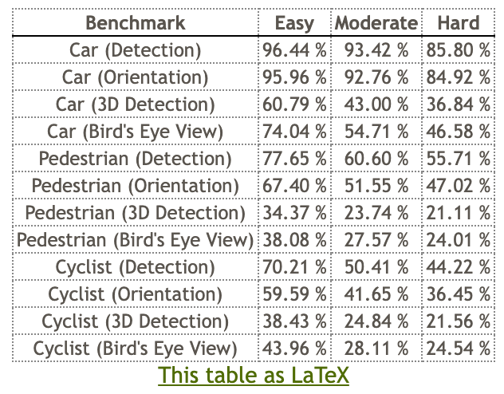
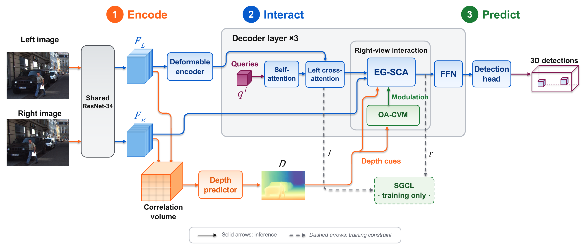

# EpiStereo

EpiStereo is a stereo 3D object detector for KITTI. 

## KITTI Online Benchmark Results

EpiStereo is evaluated on the KITTI 3D Object Detection benchmark.

**Online result:** [KITTI Test Server](https://www.cvlibs.net/datasets/kitti/eval_object_detail.php?&result=bcaf9f0de968cbefdf57b09a760c79fff6bf7c2d)

<p align="center">
  
</p>

*Official KITTI online test server result.*

## Architecture

<p align="center">
  
</p>

*Overall architecture of EpiStereo.*

## Pretrained checkpoint

Download the pretrained checkpoint from [Baidu Netdisk](https://pan.baidu.com/s/13o434SEiua2VlZgjeNPKyw?pwd=x3gn). Extraction code: `x3gn`

After downloading, place the checkpoint at `weights/checkpoint.pth`.

## Installation

Run these commands from the EpiStereo directory. Use Python 3.8 and install a
PyTorch/torchvision pair matching your CUDA installation. The source environment
used PyTorch 2.4.1, torchvision 0.19.1, and CUDA 12.4 wheels.

```bash
conda create -n epistereo python=3.8
conda activate epistereo
# Install the matching PyTorch and torchvision packages for your CUDA setup.
pip install -r requirements.txt
cd lib/models/monodetr/ops
python setup.py install
cd ../../../..
python -c "import MultiScaleDeformableAttention"
```

The CUDA extension is provided as source and must be compiled in the target
environment. A CUDA capable GPU and toolkit are required by its build script.

## KITTI data

Place or link KITTI under `data/KITTI`. For example:

```bash
mkdir -p data
ln -s /absolute/path/to/KITTI data/KITTI
```

The expected layout is:

```text
data/KITTI/
  ImageSets/train.txt
  ImageSets/val.txt
  ImageSets/test.txt
  training/image_2/
  training/image_3/
  training/calib/
  training/label_2/
  testing/image_2/
  testing/image_3/
  testing/calib/
```

For training and validation, the configuration reads `training` and the
`train.txt`/`val.txt` lists. For the pretrained checkpoint, `--test-set` selects
`testing` and `test.txt`.

## Train and run inference

```bash
# Train on KITTI train and validate on KITTI val.
python tools/train_val.py

# Run a three-epoch training check with separate output files.
python tools/train_val.py --epochs 3 --output-dir outputs/train_check_3epoch/

# Generate KITTI test predictions from the pretrained checkpoint.
python tools/train_val.py --evaluate_only --test-set

# Validate a separate checkpoint trained only on KITTI train.
python tools/train_val.py --evaluate_only --checkpoint /path/to/checkpoint_best.pth
```

## Acknowledgements

This project builds upon previous works.  
We sincerely thank the authors for open-sourcing their code:

- [MonoDETR](https://github.com/ZrrSkywalker/MonoDETR)
- [MonoDGP](https://github.com/PuFanqi23/MonoDGP)
- [StereoDETR](https://github.com/shiyi-mu/StereoDETR-OPEN)
